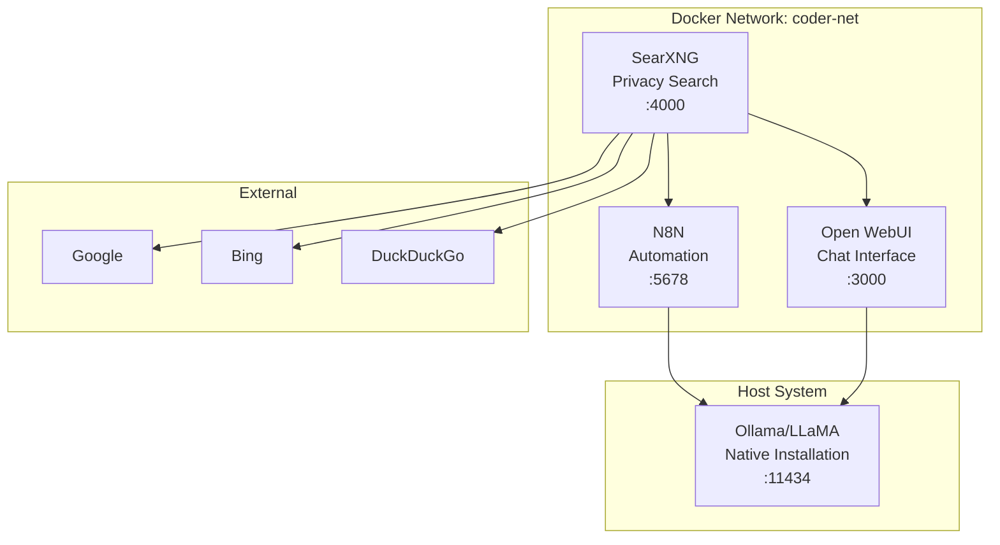

# AI Services Integration Guide

This guide explains how to wire up SearXNG, Ollama/LLaMA, and N8N together in your modular Docker development environment to create powerful AI-driven workflows.

## 🏗️ Architecture Overview



## 🚀 Quick Start

### 1. Prerequisites

Ensure you have Ollama installed natively on your system:

```bash
# Linux/WSL2
curl -fsSL https://ollama.ai/install.sh | sh

# macOS
brew install ollama

# Windows
# Download from https://ollama.ai/
```

Start Ollama and pull a model:

```bash
ollama serve
ollama pull llama3.2  # or your preferred model
```

### 2. Configure Environment

Copy the example environment file and enable AI services:

```bash
cp .env.example .env
```

Edit `.env` and set:

```bash
# Enable AI Services
AI_CHAT_PROFILE=ai
AI_SEARCH_PROFILE=ai
AUTOMATION_N8N_PROFILE=automation

# Ensure Ollama connection
OLLAMA_HOST=http://host.docker.internal:11434
```

### 3. Start All Services

```bash
# Start the complete AI stack
docker compose --profile ai --profile automation up -d

# Verify all services are running
docker compose ps
```

## 🔗 Integration Methods

### Method 1: Open WebUI with SearXNG Search

Open WebUI can integrate directly with SearXNG for enhanced AI conversations with web search capabilities.

#### Configuration

Add these environment variables to your `.env` file:

```bash
# Open WebUI SearXNG Integration
OPENWEBUI_RAG_WEB_SEARCH_ENGINE=searxng
OPENWEBUI_RAG_WEB_SEARCH_RESULT_COUNT=5
OPENWEBUI_SEARXNG_URL=http://searxng:8080
```

#### Update docker-compose.ai.yml

The Open WebUI service needs these environment variables:

```yaml
  open-webui:
    image: ghcr.io/open-webui/open-webui:main
    container_name: open-webui
    environment:
      - OLLAMA_BASE_URL=${OLLAMA_HOST}
      - WEBUI_SECRET_KEY=${WEBUI_SECRET_KEY}
      # SearXNG Integration
      - RAG_WEB_SEARCH_ENGINE=searxng
      - RAG_WEB_SEARCH_RESULT_COUNT=5
      - SEARXNG_QUERY_URL=http://searxng:8080/search?q={{query}}&format=json
    depends_on:
      - searxng
```

#### Usage

1. Open http://localhost:3000
2. In a chat, use commands like:
   - "Search for Docker best practices and summarize"
   - "Find recent AI developments and analyze trends"
   - "Research Kubernetes deployment strategies"

The AI will automatically search via SearXNG and provide informed responses.

### Method 2: N8N Automation Workflows

Create powerful automation workflows that combine search, AI processing, and actions.

#### Sample Workflow: Research Assistant

Create this workflow in N8N (http://localhost:5678):

```json
{
  "name": "AI Research Assistant",
  "nodes": [
    {
      "parameters": {
        "content": "={{ $json.query }}",
        "options": {}
      },
      "name": "Webhook Trigger",
      "type": "n8n-nodes-base.webhook",
      "webhookId": "research-assistant",
      "position": [240, 300]
    },
    {
      "parameters": {
        "url": "http://searxng:8080/search",
        "options": {
          "queryParameters": {
            "q": "={{ $json.query }}",
            "format": "json",
            "engines": "google,bing,duckduckgo",
            "categories": "general"
          }
        }
      },
      "name": "Search SearXNG",
      "type": "n8n-nodes-base.httpRequest",
      "position": [460, 300]
    },
    {
      "parameters": {
        "jsCode": "// Extract and format search results\nconst results = $input.all()[0].json.results || [];\nconst formattedResults = results.slice(0, 5).map(result => {\n  return `Title: ${result.title}\\nURL: ${result.url}\\nContent: ${result.content || 'No content'}\\n---`;\n}).join('\\n');\n\nreturn [{\n  json: {\n    searchResults: formattedResults,\n    originalQuery: $('Webhook Trigger').first().json.query\n  }\n}];"
      },
      "name": "Format Results",
      "type": "n8n-nodes-base.code",
      "position": [680, 300]
    },
    {
      "parameters": {
        "url": "http://host.docker.internal:11434/api/generate",
        "options": {
          "headers": {
            "Content-Type": "application/json"
          },
          "body": {
            "model": "llama3.2",
            "prompt": "Based on these search results about '{{ $json.originalQuery }}', provide a comprehensive analysis and summary:\\n\\n{{ $json.searchResults }}\\n\\nPlease structure your response with:\\n1. Key findings\\n2. Summary\\n3. Recommendations",
            "stream": false
          }
        }
      },
      "name": "Process with LLaMA",
      "type": "n8n-nodes-base.httpRequest",
      "position": [900, 300]
    },
    {
      "parameters": {
        "jsCode": "// Extract the response from Ollama\nconst response = $input.all()[0].json.response;\n\nreturn [{\n  json: {\n    analysis: response,\n    timestamp: new Date().toISOString(),\n    query: $('Webhook Trigger').first().json.query\n  }\n}];"
      },
      "name": "Format Response",
      "type": "n8n-nodes-base.code",
      "position": [1120, 300]
    }
  ],
  "connections": {
    "Webhook Trigger": {
      "main": [[{"node": "Search SearXNG", "type": "main", "index": 0}]]
    },
    "Search SearXNG": {
      "main": [[{"node": "Format Results", "type": "main", "index": 0}]]
    },
    "Format Results": {
      "main": [[{"node": "Process with LLaMA", "type": "main", "index": 0}]]
    },
    "Process with LLaMA": {
      "main": [[{"node": "Format Response", "type": "main", "index": 0}]]
    }
  }
}
```

#### Usage

Trigger the workflow with:

```bash
curl -X POST http://localhost:5678/webhook/research-assistant \
  -H "Content-Type: application/json" \
  -d '{"query": "latest developments in AI language models"}'
```

### Method 3: Direct API Integration

Build custom applications using the direct APIs.

#### API Endpoints

| Service | Endpoint | Purpose |
|---------|----------|---------|
| SearXNG | `http://localhost:4000/search?q={query}&format=json` | Search the web |
| SearXNG | `http://localhost:4000/autocompleter?q={query}` | Get search suggestions |
| Ollama | `http://localhost:11434/api/generate` | Generate text |
| Ollama | `http://localhost:11434/api/chat` | Chat completion |
| N8N | `http://localhost:5678/webhook/{webhook-id}` | Trigger workflows |

#### Example: Python Integration

```python
import requests
import json

class AIResearchAssistant:
    def __init__(self):
        self.searxng_url = "http://localhost:4000"
        self.ollama_url = "http://localhost:11434"
    
    def search_web(self, query, engines="google,bing,duckduckgo"):
        """Search the web using SearXNG"""
        params = {
            'q': query,
            'format': 'json',
            'engines': engines
        }
        response = requests.get(f"{self.searxng_url}/search", params=params)
        return response.json()
    
    def analyze_with_llama(self, prompt, model="llama3.2"):
        """Process text with Ollama/LLaMA"""
        data = {
            'model': model,
            'prompt': prompt,
            'stream': False
        }
        response = requests.post(f"{self.ollama_url}/api/generate", json=data)
        return response.json()
    
    def research_topic(self, topic):
        """Complete research workflow"""
        # Step 1: Search the web
        search_results = self.search_web(topic)
        
        # Step 2: Format results for AI analysis
        results_text = ""
        for result in search_results.get('results', [])[:5]:
            results_text += f"Title: {result.get('title', '')}\n"
            results_text += f"Content: {result.get('content', '')}\n---\n"
        
        # Step 3: Analyze with LLaMA
        prompt = f"""
        Analyze these search results about '{topic}' and provide:
        1. Key findings
        2. Summary
        3. Recommendations
        
        Search Results:
        {results_text}
        """
        
        analysis = self.analyze_with_llama(prompt)
        return analysis.get('response', '')

# Usage
assistant = AIResearchAssistant()
result = assistant.research_topic("Docker security best practices")
print(result)
```

## 🔧 Advanced Configuration

### Custom SearXNG Engines

Edit `/home/nas/Coder/Docker/searxng/settings.yml` to add custom search engines:

```yaml
engines:
  - name: github
    engine: github
    categories: it
    
  - name: stackoverflow
    engine: stackoverflow
    categories: it
    
  - name: arxiv
    engine: arxiv
    categories: science
    
  - name: reddit
    engine: reddit
    categories: social media
```

### N8N Workflow Templates

#### 1. Content Monitor
Monitor specific topics and get AI summaries:

```bash
# Webhook: /webhook/content-monitor
# Body: {"topic": "AI news", "frequency": "daily"}
```

#### 2. Research Pipeline
Automated research with source verification:

```bash
# Webhook: /webhook/research-pipeline
# Body: {"query": "quantum computing trends", "depth": "comprehensive"}
```

#### 3. SEO Analyzer
Analyze search results for SEO insights:

```bash
# Webhook: /webhook/seo-analyzer
# Body: {"keyword": "docker containers", "competitor_analysis": true}
```

### Performance Optimization

#### SearXNG Configuration
```yaml
# In searxng/settings.yml
search:
  safe_search: 0
  autocomplete: "google"
  default_lang: "auto"
  # Increase timeout for better results
  request_timeout: 5.0
  # Limit concurrent requests
  pool_connections: 100
  pool_maxsize: 10
```

#### Ollama Optimization
```bash
# Set appropriate model for your hardware
ollama pull llama3.2:8b     # For systems with 8GB+ RAM
ollama pull llama3.2:3b     # For systems with 4GB+ RAM
ollama pull llama3.2:1b     # For systems with 2GB+ RAM
```

## 🚨 Troubleshooting

### Common Issues

#### 1. SearXNG Not Responding
```bash
# Check logs
docker compose logs searxng

# Restart service
docker compose restart searxng
```

#### 2. Ollama Connection Failed
```bash
# Verify Ollama is running
ollama list

# Check if port is accessible
curl http://localhost:11434/api/tags
```

#### 3. N8N Webhook Not Found
```bash
# Check N8N logs
docker compose logs n8n

# Verify webhook URL in workflow settings
```

#### 4. Network Communication Issues
```bash
# Test internal network connectivity
docker compose exec open-webui ping searxng
docker compose exec n8n ping searxng
```

### Debug Commands

```bash
# Check all service status
docker compose ps

# View logs for all AI services
docker compose logs open-webui searxng n8n

# Test API endpoints
curl "http://localhost:4000/search?q=test&format=json"
curl "http://localhost:11434/api/tags"
curl "http://localhost:3000" -I
curl "http://localhost:5678" -I
```

## 🎯 Use Cases

### 1. Research Assistant
- **Input**: Research topic
- **Process**: SearXNG → LLaMA analysis
- **Output**: Comprehensive research summary

### 2. Content Creation Pipeline
- **Input**: Content brief
- **Process**: SearXNG research → LLaMA writing → Review
- **Output**: AI-generated content with sources

### 3. Market Intelligence
- **Input**: Company/product name
- **Process**: Multi-source search → Competitive analysis
- **Output**: Market insights report

### 4. Technical Documentation
- **Input**: Technology stack
- **Process**: Search best practices → Generate docs
- **Output**: Structured documentation

### 5. News Monitoring
- **Input**: Keywords/topics
- **Process**: Scheduled searches → Trend analysis
- **Output**: Daily/weekly intelligence reports

## 📚 Additional Resources

- [SearXNG Documentation](https://docs.searxng.org/)
- [Ollama Documentation](https://ollama.ai/docs)
- [N8N Documentation](https://docs.n8n.io/)
- [Open WebUI Documentation](https://docs.openwebui.com/)

## 🤝 Contributing

To extend this integration:

1. Add new workflow templates to `/n8n/workflows/`
2. Create custom SearXNG engines in `/searxng/engines/`
3. Develop API clients in `/scripts/integrations/`
4. Document new use cases in this file

## 📝 License

This configuration is part of the Coder Development Platform and follows the same licensing terms.
